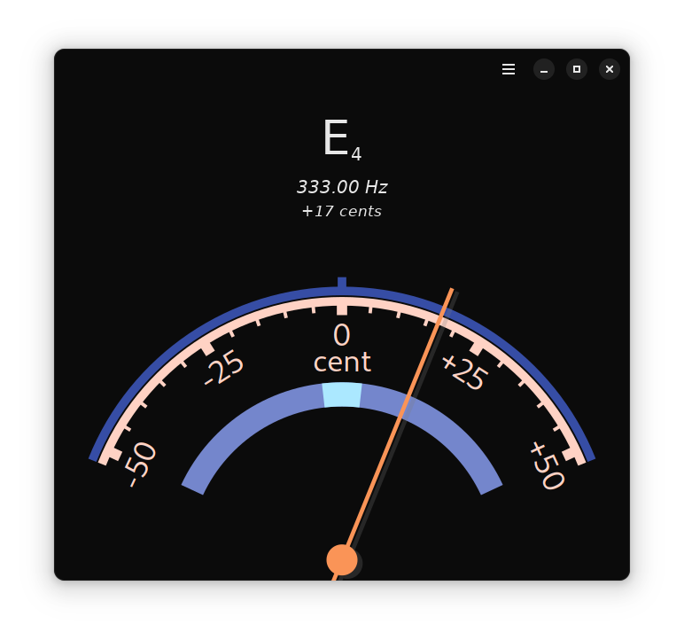

Chromatic
======

Fine-tune your instruments with Chromatic. 
Chromatic detects the frequency of audio input, converts it to a musical note with the correct semitone and octave, and displays the cents error. Cents are displayed on an analog gauge to make tuning more visually intuitive. Requires PulseAudio or PipeWire.

  

Flatpak
--------------

You can install stable builds of Chromatic from [Flathub](https://flathub.org)
by using this command:

    flatpak remote-add --if-not-exists flathub https://flathub.org/repo/flathub.flatpakrepo
    flatpak install flathub io.github.nate_xyz.Chromatic

